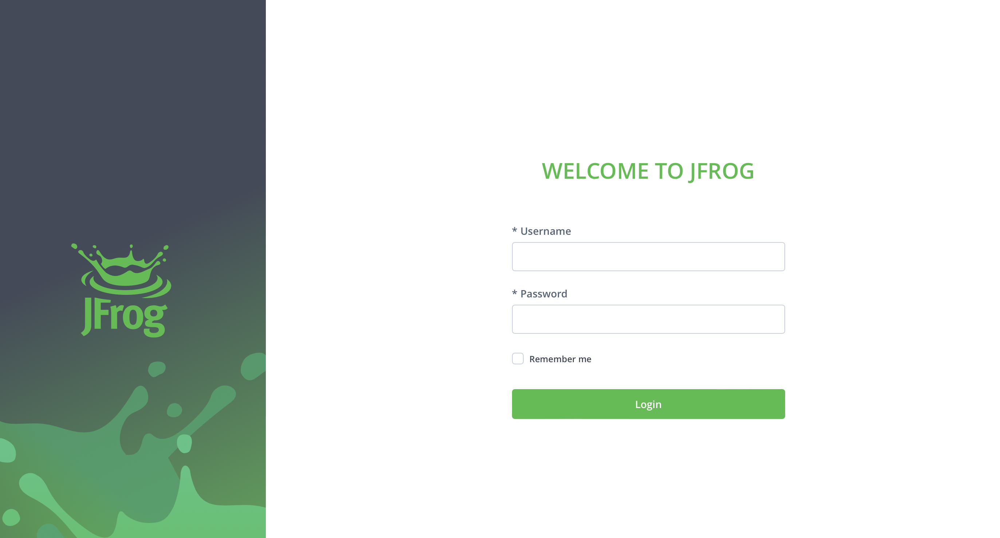

# ansible-project
CONTINUOUS INTEGRATION WITH JENKINS | ANSIBLE | ARTIFACTORY | SONARQUBE | PHP


## Configuring Ansible For Jenkins Deployment

1. Navigate to Jenkins URL

2. Install & Open Blue Ocean Jenkins Plugin

3. Create a new pipeline


4. Select Github


5. Connect Jenkins with GitHub


6. Login to GitHub & Generate an Access Token 


7. Paste generated Access Token and connect


8. Create a new Pipeline


At this point you may not have a Jenkinsfile in the Ansible repository, so Blue Ocean will attempt to give you some guidance to create one. But we do not need that. We will rather create one ourselves.Click on Administration to exit the Blue Ocean console.

Here is the newly created pipeline. It takes the name of your GitHub repository.


- Inside the Ansible project, create a new directory deploy and start a new file Jenkinsfile inside the directory.


```
pipeline {
    agent any

  stages {
    stage("Initial cleanup") {
      steps {
        dir("${WORKSPACE}"){
          deleteDir()
        }
      }
    }

    stage('Build') {
      steps {
        script {
          sh 'echo "Building Stage"'
        }
      }
    }

    stage('Test') {
      steps {
        script {
          sh 'echo "Testing Stage"'
        }
      }
    }

    stage('Package') {
      steps {
        script {
          sh 'echo "Packaging Stage"'
        }
      }
    }

    stage('Deploy') {
      steps {
        script {
          sh 'echo "Deployment Stage"'
        }
      }
    }

    stage('Clean Up') {
      steps {
        script {
          sh 'echo "Cleaning Stage"'
        }
      }
    }

    stage("cleanup") {
      steps {
        cleanWs()
       }
    }
}


```

## RUNNING ANSIBLE PLAYBOOK FROM JENKINS

1. Installing Ansible on Jenkins
2. Install Ansible plugin in Jenkins UI

- Parameterizing Jenkinsfile For Ansible Deployment

To deploy to other environments, we will need to use parameters.

1. Update `sit` inventory with new servers

```
[tooling]
<SIT-Tooling-Web-Server-Private-IP-Address>

[todo]
<SIT-Todo-Web-Server-Private-IP-Address>

[nginx]
<SIT-Nginx-Private-IP-Address>

[db:vars]
ansible_user=ec2-user
ansible_python_interpreter=/usr/bin/python

[db]
<SIT-DB-Server-Private-IP-Address>
```

2. Update Jenkinsfile to introduce parameterization. Below is just one parameter. It has a default value in case if no value is specified at execution. It also has a description so that everyone is aware of its purpose.

```
pipeline {
    agent any

    parameters {
      string(name: 'inventory', defaultValue: 'dev',  description: 'This is the inventory file for the environment to deploy configuration')
    }
```

3. In the Ansible execution section, remove the hardcoded inventory/dev and replace with `inventory/${inventory}

From now on, each time you hit on execute, it will expect an input.

Notice that the default value loads up, but we can now specify which environment we want to deploy the configuration to. Simply type sit and hit Run.

## CI/CD PIPELINE FOR TODO APPLICATION

We already have tooling website as a part of deployment through Ansible. Here we will introduce another PHP application to add to the list of software products we are managing in our infrastructure. The good thing with this particular application is that it has unit tests, and it is an ideal application to show an end-to-end CI/CD pipeline for a particular application.

Our goal here is to deploy the application onto servers directly from Artifactory rather than from git. Update your Ansible with Artifactory role.


### Phase 1: Prepare Jenkins

1. Fork the repository below into your GitHub account

`https://github.com/darey-devops/php-todo.git`

2. On your Jenkins server, install PHP, its dependencies and Composer tool.

`sudo apt install -y zip libapache2-mod-php phploc php-{xml,bcmath,bz2,intl,gd,mbstring,mysql,zip}`

3. Install Jenkins Plugin

  1. Plot plugin

  2. Artifactory plugin

- We will use plot plugin to display tests reports, and code coverage information.
- The Artifactory plugin will be used to easily upload code artifacts into an Artifactory server.

4. In Jenkins UI configure Artifactory, configure the server ID, URL and Credentials, run Test Connection.




- Configure the server ID, URL and Credentials, run Test Connection.


### Phase 2: Integrate Artifactory repository with Jenkins

1. Create a dummy Jenkinsfile in the repository (in the PHP repo)

2. Using Blue Ocean, create a multibranch Jenkins pipeline

3. On the database server, create database and user

```
Create database homestead;
CREATE USER 'homestead'@'%' IDENTIFIED BY 'sePret^i';
GRANT ALL PRIVILEGES ON * . * TO 'homestead'@'%';
```

4. Update the database connectivity requirements in the file `.env.sample` with your IP address.

5. Update Jenkinsfile with proper pipeline configuration (in the PHP repo)

```
pipeline {
    agent any

  stages {

     stage("Initial cleanup") {
          steps {
            dir("${WORKSPACE}") {
              deleteDir()
            }
          }
        }

    stage('Checkout SCM') {
      steps {
            git branch: 'main', url: 'https://github.com/MayorFaj/php-todo.git'
      }
    }

    stage('Prepare Dependencies') {
      steps {
             sh 'mv .env.sample .env'
             sh 'composer install'
             sh 'php artisan migrate'
             sh 'php artisan db:seed'
             sh 'php artisan key:generate'
      }
    }
  }
}
```
- ensure composer is installed on the system where you're running the command (in this case the Jenkins server)

```
curl -sS https://getcomposer.org/installer | php
sudo mv composer.phar /usr/local/bin/composer
```

Notice the Prepare Dependencies section

- The required file by PHP is .env so we are renaming .env.sample to .env
- Composer is used by PHP to install all the dependent libraries used by the application
- php artisan uses the .env file to setup the required database objects – (After successful run of this step, login to the database, run show tables and you will see the tables being created for you).


Update the Jenkinsfile to include Unit tests step

```
stage('Execute Unit Tests') {
      steps {
             sh './vendor/bin/phpunit'
      } 
```

### Phase 3 – Code Quality Analysis

- For PHP the most commonly tool used for code quality analysis is phploc.

The data produced by phploc can be ploted onto graphs in Jenkins


