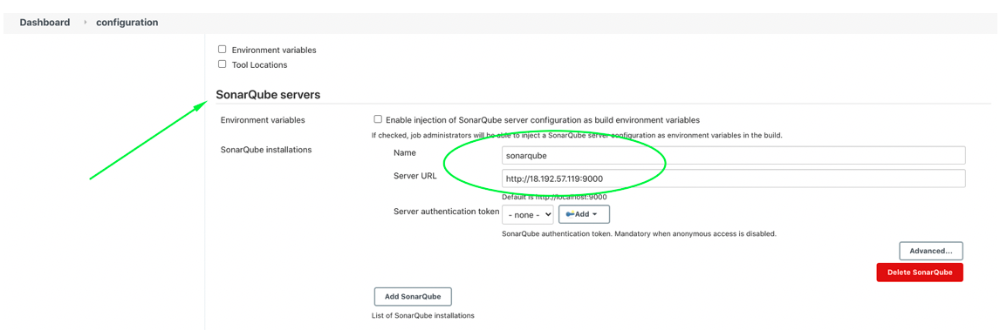

# ansible-project
CONTINUOUS INTEGRATION WITH JENKINS | ANSIBLE | ARTIFACTORY | SONARQUBE | PHP


## Configuring Ansible For Jenkins Deployment

1. Navigate to Jenkins URL

2. Install & Open Blue Ocean Jenkins Plugin

3. Create a new pipeline


4. Select Github


5. Connect Jenkins with GitHub


6. Login to GitHub & Generate an Access Token 


7. Paste generated Access Token and connect


8. Create a new Pipeline


At this point you may not have a Jenkinsfile in the Ansible repository, so Blue Ocean will attempt to give you some guidance to create one. But we do not need that. We will rather create one ourselves.Click on Administration to exit the Blue Ocean console.

Here is the newly created pipeline. It takes the name of your GitHub repository.


- Inside the Ansible project, create a new directory deploy and start a new file Jenkinsfile inside the directory.


```
pipeline {
    agent any

  stages {
    stage("Initial cleanup") {
      steps {
        dir("${WORKSPACE}"){
          deleteDir()
        }
      }
    }

    stage('Build') {
      steps {
        script {
          sh 'echo "Building Stage"'
        }
      }
    }

    stage('Test') {
      steps {
        script {
          sh 'echo "Testing Stage"'
        }
      }
    }

    stage('Package') {
      steps {
        script {
          sh 'echo "Packaging Stage"'
        }
      }
    }

    stage('Deploy') {
      steps {
        script {
          sh 'echo "Deployment Stage"'
        }
      }
    }

    stage('Clean Up') {
      steps {
        script {
          sh 'echo "Cleaning Stage"'
        }
      }
    }

    stage("cleanup") {
      steps {
        cleanWs()
       }
    }
}


```

## RUNNING ANSIBLE PLAYBOOK FROM JENKINS

1. Installing Ansible on Jenkins
2. Install Ansible plugin in Jenkins UI

- Parameterizing Jenkinsfile For Ansible Deployment

To deploy to other environments, we will need to use parameters.

1. Update `sit` inventory with new servers

```
[tooling]
<SIT-Tooling-Web-Server-Private-IP-Address>

[todo]
<SIT-Todo-Web-Server-Private-IP-Address>

[nginx]
<SIT-Nginx-Private-IP-Address>

[db:vars]
ansible_user=ec2-user
ansible_python_interpreter=/usr/bin/python

[db]
<SIT-DB-Server-Private-IP-Address>
```

2. Update Jenkinsfile to introduce parameterization. Below is just one parameter. It has a default value in case if no value is specified at execution. It also has a description so that everyone is aware of its purpose.

```
pipeline {
    agent any

    parameters {
      string(name: 'inventory', defaultValue: 'dev',  description: 'This is the inventory file for the environment to deploy configuration')
    }
```

3. In the Ansible execution section, remove the hardcoded inventory/dev and replace with `inventory/${inventory}

From now on, each time you hit on execute, it will expect an input.

Notice that the default value loads up, but we can now specify which environment we want to deploy the configuration to. Simply type sit and hit Run.

## CI/CD PIPELINE FOR TODO APPLICATION

We already have tooling website as a part of deployment through Ansible. Here we will introduce another PHP application to add to the list of software products we are managing in our infrastructure. The good thing with this particular application is that it has unit tests, and it is an ideal application to show an end-to-end CI/CD pipeline for a particular application.

Our goal here is to deploy the application onto servers directly from Artifactory rather than from git. Update your Ansible with Artifactory role.


### Phase 1: Prepare Jenkins

1. Fork the repository below into your GitHub account

`https://github.com/darey-devops/php-todo.git`

2. On your Jenkins server, install PHP, its dependencies and Composer tool.

`sudo apt install -y zip libapache2-mod-php phploc php-{xml,bcmath,bz2,intl,gd,mbstring,mysql,zip}`

3. Install Jenkins Plugin

  1. Plot plugin

  2. Artifactory plugin

- We will use plot plugin to display tests reports, and code coverage information.
- The Artifactory plugin will be used to easily upload code artifacts into an Artifactory server.

4. In Jenkins UI configure Artifactory, configure the server ID, URL and Credentials, run Test Connection.


- Configure the server ID, URL and Credentials, run Test Connection.


### Phase 2: Integrate Artifactory repository with Jenkins

1. Create a dummy Jenkinsfile in the repository (in the PHP repo)

2. Using Blue Ocean, create a multibranch Jenkins pipeline

3. On the database server, create database and user

```
Create database homestead;
CREATE USER 'homestead'@'%' IDENTIFIED BY 'sePret^i';
GRANT ALL PRIVILEGES ON * . * TO 'homestead'@'%';
```

4. Update the database connectivity requirements in the file `.env.sample` with your IP address.


5. Update Jenkinsfile with proper pipeline configuration (in the PHP repo)

```
pipeline {
    agent any

  stages {

     stage("Initial cleanup") {
          steps {
            dir("${WORKSPACE}") {
              deleteDir()
            }
          }
        }

    stage('Checkout SCM') {
      steps {
            git branch: 'main', url: 'https://github.com/MayorFaj/php-todo.git'
      }
    }

    stage('Prepare Dependencies') {
      steps {
             sh 'mv .env.sample .env'
             sh 'composer install'
             sh 'php artisan migrate'
             sh 'php artisan db:seed'
             sh 'php artisan key:generate'
      }
    }
  }
}
```
- ensure composer is installed on the system where you're running the command (in this case the Jenkins server)

```
curl -sS https://getcomposer.org/installer | php
sudo mv composer.phar /usr/local/bin/composer
composer --version
```


Notice the Prepare Dependencies section

- The required file by PHP is .env so we are renaming .env.sample to .env
- Composer is used by PHP to install all the dependent libraries used by the application
- php artisan uses the .env file to setup the required database objects – (After successful run of this step, login to the database, run show tables and you will see the tables being created for you).


Update the Jenkinsfile to include Unit tests step

```
stage('Execute Unit Tests') {
      steps {
             sh './vendor/bin/phpunit'
      }
}
```


### Phase 3 – Code Quality Analysis

- For PHP the most commonly tool used for code quality analysis is phploc.

The data produced by phploc can be ploted onto graphs in Jenkins

1. Add the code analysis step in Jenkinsfile. The output of the data will be saved in build/logs/phploc.csv file.

```
stage('Code Analysis') {
  steps {
        sh 'phploc app/ --log-csv build/logs/phploc.csv'

  }
}
```


2. Plot the data using plot Jenkins plugin.
This plugin provides generic plotting (or graphing) capabilities in Jenkins. It will plot one or more single values variations across builds in one or more plots. Plots for a particular job (or project) are configured in the job configuration screen, where each field has additional help information. Each plot can have one or more lines (called data series). After each build completes the plots’ data series latest values are pulled from the CSV file generated by phploc.

```
stage('Plot Code Coverage Report') {
      steps {

            plot csvFileName: 'plot-396c4a6b-b573-41e5-85d8-73613b2ffffb.csv', csvSeries: [[displayTableFlag: false, exclusionValues: 'Lines of Code (LOC),Comment Lines of Code (CLOC),Non-Comment Lines of Code (NCLOC),Logical Lines of Code (LLOC)                          ', file: 'build/logs/phploc.csv', inclusionFlag: 'INCLUDE_BY_STRING', url: '']], group: 'phploc', numBuilds: '100', style: 'line', title: 'A - Lines of code', yaxis: 'Lines of Code'
            plot csvFileName: 'plot-396c4a6b-b573-41e5-85d8-73613b2ffffb.csv', csvSeries: [[displayTableFlag: false, exclusionValues: 'Directories,Files,Namespaces', file: 'build/logs/phploc.csv', inclusionFlag: 'INCLUDE_BY_STRING', url: '']], group: 'phploc', numBuilds: '100', style: 'line', title: 'B - Structures Containers', yaxis: 'Count'
            plot csvFileName: 'plot-396c4a6b-b573-41e5-85d8-73613b2ffffb.csv', csvSeries: [[displayTableFlag: false, exclusionValues: 'Average Class Length (LLOC),Average Method Length (LLOC),Average Function Length (LLOC)', file: 'build/logs/phploc.csv', inclusionFlag: 'INCLUDE_BY_STRING', url: '']], group: 'phploc', numBuilds: '100', style: 'line', title: 'C - Average Length', yaxis: 'Average Lines of Code'
            plot csvFileName: 'plot-396c4a6b-b573-41e5-85d8-73613b2ffffb.csv', csvSeries: [[displayTableFlag: false, exclusionValues: 'Cyclomatic Complexity / Lines of Code,Cyclomatic Complexity / Number of Methods ', file: 'build/logs/phploc.csv', inclusionFlag: 'INCLUDE_BY_STRING', url: '']], group: 'phploc', numBuilds: '100', style: 'line', title: 'D - Relative Cyclomatic Complexity', yaxis: 'Cyclomatic Complexity by Structure'      
            plot csvFileName: 'plot-396c4a6b-b573-41e5-85d8-73613b2ffffb.csv', csvSeries: [[displayTableFlag: false, exclusionValues: 'Classes,Abstract Classes,Concrete Classes', file: 'build/logs/phploc.csv', inclusionFlag: 'INCLUDE_BY_STRING', url: '']], group: 'phploc', numBuilds: '100', style: 'line', title: 'E - Types of Classes', yaxis: 'Count'
            plot csvFileName: 'plot-396c4a6b-b573-41e5-85d8-73613b2ffffb.csv', csvSeries: [[displayTableFlag: false, exclusionValues: 'Methods,Non-Static Methods,Static Methods,Public Methods,Non-Public Methods', file: 'build/logs/phploc.csv', inclusionFlag: 'INCLUDE_BY_STRING', url: '']], group: 'phploc', numBuilds: '100', style: 'line', title: 'F - Types of Methods', yaxis: 'Count'
            plot csvFileName: 'plot-396c4a6b-b573-41e5-85d8-73613b2ffffb.csv', csvSeries: [[displayTableFlag: false, exclusionValues: 'Constants,Global Constants,Class Constants', file: 'build/logs/phploc.csv', inclusionFlag: 'INCLUDE_BY_STRING', url: '']], group: 'phploc', numBuilds: '100', style: 'line', title: 'G - Types of Constants', yaxis: 'Count'
            plot csvFileName: 'plot-396c4a6b-b573-41e5-85d8-73613b2ffffb.csv', csvSeries: [[displayTableFlag: false, exclusionValues: 'Test Classes,Test Methods', file: 'build/logs/phploc.csv', inclusionFlag: 'INCLUDE_BY_STRING', url: '']], group: 'phploc', numBuilds: '100', style: 'line', title: 'I - Testing', yaxis: 'Count'
            plot csvFileName: 'plot-396c4a6b-b573-41e5-85d8-73613b2ffffb.csv', csvSeries: [[displayTableFlag: false, exclusionValues: 'Logical Lines of Code (LLOC),Classes Length (LLOC),Functions Length (LLOC),LLOC outside functions or classes ', file: 'build/logs/phploc.csv', inclusionFlag: 'INCLUDE_BY_STRING', url: '']], group: 'phploc', numBuilds: '100', style: 'line', title: 'AB - Code Structure by Logical Lines of Code', yaxis: 'Logical Lines of Code'
            plot csvFileName: 'plot-396c4a6b-b573-41e5-85d8-73613b2ffffb.csv', csvSeries: [[displayTableFlag: false, exclusionValues: 'Functions,Named Functions,Anonymous Functions', file: 'build/logs/phploc.csv', inclusionFlag: 'INCLUDE_BY_STRING', url: '']], group: 'phploc', numBuilds: '100', style: 'line', title: 'H - Types of Functions', yaxis: 'Count'
            plot csvFileName: 'plot-396c4a6b-b573-41e5-85d8-73613b2ffffb.csv', csvSeries: [[displayTableFlag: false, exclusionValues: 'Interfaces,Traits,Classes,Methods,Functions,Constants', file: 'build/logs/phploc.csv', inclusionFlag: 'INCLUDE_BY_STRING', url: '']], group: 'phploc', numBuilds: '100', style: 'line', title: 'BB - Structure Objects', yaxis: 'Count'

      }
    }
```


- You should now see a Plot menu item on the left menu. Click on it to see the charts


3. Bundle the application code  into an artifact (archived package) and upload to Artifactory.

```
stage ('Package Artifact') {
    steps {
            sh 'zip -qr php-todo.zip ${WORKSPACE}/*'
     }
    }
```


4. Publish the resulted artifact into Artifactory.

```
stage ('Upload Artifact to Artifactory') {
          steps {
            script { 
                 def server = Artifactory.server 'artifactory-server'                 
                 def uploadSpec = """{
                    "files": [
                      {
                       "pattern": "php-todo.zip",
                       "target": "<name-of-artifact-repository>/php-todo",
                       "props": "type=zip;status=ready"

                       }
                    ]
                 }""" 

                 server.upload spec: uploadSpec
               }
            }

        }
```


5. Deploy the application to the dev environment by launching Ansible pipeline

```
stage ('Deploy to Dev Environment') {
    steps {
    build job: 'ansible-project/main', parameters: [[$class: 'StringParameterValue', name: 'env', value: 'dev']], propagate: false, wait: true
    }
  }
```


The build job used in this step tells Jenkins to start another job. In this case it is the ansible-project job, and we are targeting the main branch. Hence, we have ansible-project/main. Since the Ansible project requires parameters to be passed in, we have included this by specifying the parameters section. The name of the parameter is env and its value is dev. Meaning, deploy to the Development environment.


But how are we certain that the code being deployed has the quality that meets corporate and customer requirements? Even though  `Unit Tests` and `Code Coverage Analysis` have been implemented with phpunit and phploc, there is need to implement `Quality Gate` to ensure that ONLY code with the required code coverage, and other quality standards make it through to the environments.

To achieve this, we need to configure SonarQube – An open-source platform developed by SonarSource for continuous inspection of code quality to perform automatic reviews with static analysis of code to detect bugs, code smells, and security vulnerabilities.

## Install Sonarqube

- SonarQube is a tool that can be used to create quality gates for software projects, and the ultimate goal is to be able to ship only quality software code.

- Despite that DevOps CI/CD pipeline helps with fast software delivery, it is of the same importance to ensure the quality of such delivery. Hence, we will need SonarQube to set up Quality gates.

- Install SonarQube on Ubuntu 20.04 With PostgreSQL as Backend Database

- We will make some Linux Kernel configuration changes to ensure optimal performance of the tool – we will increase `vm.max_map_count`, `f`ile discriptor` and `ulimit`.

**Tune Linux Kernel**

This can be achieved by making session changes which does not persist beyond the current session terminal

```
sudo sysctl -w vm.max_map_count=262144
sudo sysctl -w fs.file-max=65536
ulimit -n 65536
ulimit -u 4096
```

To make a permanent change, edit the file `/etc/security/limits.conf` and append the below

```
sonarqube   -   nofile   65536
sonarqube   -   nproc    4096
```

- Before installing, update and upgrade system packages

```
sudo apt-get update
sudo apt-get upgrade
```

- Install `wget` and `unzip` packages

`sudo apt-get install wget unzip -y`

- Install OpenJDK and Java Runtime Environment (JRE) 11

 ```
 sudo apt-get install openjdk-11-jdk -y
 sudo apt-get install openjdk-11-jre -y
 ```

- Set default JDK – To set default JDK or switch to OpenJDK enter below command:

`sudo update-alternatives --config java`

## Install and Setup PostgreSQL 10 Database for SonarQube

- The command below will add PostgreSQL repo to the repo list:

```
sudo sh -c 'echo "deb http://apt.postgresql.org/pub/repos/apt/ `lsb_release -cs`-pgdg main" >> /etc/apt/sources.list.d/pgdg.list'
```

- Download PostgreSQL software

`wget -q https://www.postgresql.org/media/keys/ACCC4CF8.asc -O - | sudo apt-key add -`

- Install PostgreSQL Database Server

`sudo apt-get -y install postgresql postgresql-contrib`

- Start PostgreSQL Database Server

`sudo systemctl start postgresql`

- Enable it to start automatically at boot time

`sudo systemctl enable postgresql`

- Change the password for default postgres user (Pass in the password you intend to use, and remember to save it somewhere)

`sudo passwd postgres`

- Switch to the postgres user

`su - postgres`

- Create a new user by typing

`createuser sonar`

- Switch to the PostgreSQL shell

`psql`

- Set a password for the newly created user for SonarQube database

`ALTER USER sonar WITH ENCRYPTED password 'sonar';`

- Create a new database for PostgreSQL database by running:

`CREATE DATABASE sonarqube OWNER sonar;`

- Grant all privileges to sonar user on sonarqube Database.

`grant all privileges on DATABASE sonarqube to sonar;`

- Exit from the psql shell:

`\q`

- Switch back to the sudo user by running the exit command.

`exit`

- Navigate to the tmp directory to temporarily download the installation files

`cd /tmp && sudo wget https://binaries.sonarsource.com/Distribution/sonarqube/sonarqube-7.9.3.zip`

- Unzip the archive setup to `/opt directory`

`sudo unzip sonarqube-7.9.3.zip -d /opt`

- Move extracted setup to /opt/sonarqube directory

`sudo mv /opt/sonarqube-7.9.3 /opt/sonarqube`

### CONFIGURE SONARQUBE

We cannot run SonarQube as a root user, if you run using root user it will stop automatically. The ideal approach will be to create a separate group and a user to run SonarQube

- Create a group sonar

`sudo groupadd sonar`

- Now add a user with control over the /opt/sonarqube directory

`sudo useradd -c "user to run SonarQube" -d /opt/sonarqube -g sonar sonar`
`sudo chown sonar:sonar /opt/sonarqube -R`

- Open SonarQube configuration file using your favourite text editor (e.g., nano or vim)

`sudo vim /opt/sonarqube/conf/sonar.properties`

- Find the following lines:

#sonar.jdbc.username=
#sonar.jdbc.password=

- Uncomment them and provide the values of PostgreSQL Database username and password:

```
#--------------------------------------------------------------------------------------------------

# DATABASE

#

# IMPORTANT:

# - The embedded H2 database is used by default. It is recommended for tests but not for

#   production use. Supported databases are Oracle, PostgreSQL and Microsoft SQLServer.

# - Changes to database connection URL (sonar.jdbc.url) can affect SonarSource licensed products.

# User credentials.

# Permissions to create tables, indices and triggers must be granted to JDBC user.

# The schema must be created first.

sonar.jdbc.username=sonar
sonar.jdbc.password=sonar
sonar.jdbc.url=jdbc:postgresql://localhost:5432/sonarqube
```

- Edit the sonar script file and set RUN_AS_USER

`sudo nano /opt/sonarqube/bin/linux-x86-64/sonar.sh`

```
# If specified, the Wrapper will be run as the specified user.

# IMPORTANT - Make sure that the user has the required privileges to write

#  the PID file and wrapper.log files.  Failure to be able to write the log

#  file will cause the Wrapper to exit without any way to write out an error

#  message.

# NOTE - This will set the user which is used to run the Wrapper as well as

#  the JVM and is not useful in situations where a privileged resource or

#  port needs to be allocated prior to the user being changed.

RUN_AS_USER=sonar
```

- Now, to start SonarQube we need to do following:

- Switch to sonar user

`sudo su sonar`

- Move to the script directory

`cd /opt/sonarqube/bin/linux-x86-64/`

- Run the script to start SonarQube

`./sonar.sh start`

- Expected output shall be as:

```
Starting SonarQube...

Started SonarQube
```

- Check SonarQube running status:


`./sonar.sh status`

Sample Output below:

```
./sonar.sh status

SonarQube is running (176483).
```

- To check SonarQube logs, navigate to /opt/sonarqube/logs/sonar.log directory

`tail /opt/sonarqube/logs/sonar.log`

Output

```
INFO  app[][o.s.a.ProcessLauncherImpl] Launch process[[key='ce', ipcIndex=3, logFilenamePrefix=ce]] from [/opt/sonarqube]: /usr/lib/jvm/java-11-openjdk-amd64/bin/java -Djava.awt.headless=true -Dfile.encoding=UTF-8 -Djava.io.tmpdir=/opt/sonarqube/temp --add-opens=java.base/java.util=ALL-UNNAMED -Xmx512m -Xms128m -XX:+HeapDumpOnOutOfMemoryError -Dhttp.nonProxyHosts=localhost|127.*|[::1] -cp ./lib/common/*:/opt/sonarqube/lib/jdbc/h2/h2-1.3.176.jar org.sonar.ce.app.CeServer /opt/sonarqube/temp/sq-process15059956114837198848properties

 INFO  app[][o.s.a.SchedulerImpl] Process[ce] is up

 INFO  app[][o.s.a.SchedulerImpl] SonarQube is up
 ```

You can see that SonarQube is up and running

## Configure SonarQube to run as a systemd service

- Stop the currently running SonarQube service

`cd /opt/sonarqube/bin/linux-x86-64/`

- Run the script to start SonarQube

`./sonar.sh stop`

- Create a systemd service file for SonarQube to run as System Startup.

`sudo nano /etc/systemd/system/sonar.service`

- Add the configuration below for systemd to determine how to start, stop, check status, or restart the SonarQube service.

```
[Unit]
Description=SonarQube service
After=syslog.target network.target

[Service]
Type=forking

ExecStart=/opt/sonarqube/bin/linux-x86-64/sonar.sh start
ExecStop=/opt/sonarqube/bin/linux-x86-64/sonar.sh stop

User=sonar
Group=sonar
Restart=always

LimitNOFILE=65536
LimitNPROC=4096

[Install]
WantedBy=multi-user.target
```

- Save the file and control the service with systemctl

```
sudo systemctl start sonar
sudo systemctl enable sonar
sudo systemctl status sonar
```

### Access SonarQube

To access SonarQube using browser, type server’s IP address followed by port 9000

http://server_IP:9000/sonar OR http://localhost:9000/sonar

Login to SonarQube with default administrator username and password – admin


- Now, when SonarQube is up and running, it is time to setup our Quality gate in Jenkins.

### CONFIGURE SONARQUBE AND JENKINS FOR QUALITY GATE

- In Jenkins, install SonarQubeScanner plugin

- Navigate to configure system in Jenkins. Add SonarQube server as shown below:


`Manage Jenkins > Configure System`



- Generate authentication token in SonarQube

`User > My Account > Security > Generate Tokens`


- Configure Quality Gate Jenkins Webhook in SonarQube – The URL should point to your Jenkins server http://{JENKINS_HOST}/sonarqube-webhook/

`Administration > Configuration > Webhooks > Create`


- Setup SonarQube scanner from Jenkins – Global Tool Configuration

`Manage Jenkins > Global Tool Configuration`


### Update Jenkins Pipeline to include SonarQube scanning and Quality Gate

Below is the snippet for a Quality Gate stage in Jenkinsfile.

```
stage('SonarQube Quality Gate') {
        environment {
            scannerHome = tool 'SonarQubeScanner'
        }
        steps {
            withSonarQubeEnv('sonarqube') {
                sh "${scannerHome}/bin/sonar-scanner"
            }

        }
    }
```

**NOTE:** The above step will fail because we have not updated `sonar-scanner.properties

- Configure sonar-scanner.properties – From the step above, Jenkins will install the scanner tool on the Linux server. You will need to go into the tools directory on the server to configure the properties file in which SonarQube will require to function during pipeline execution.

`cd /var/lib/jenkins/tools/hudson.plugins.sonar.SonarRunnerInstallation/SonarQubeScanner/conf/`

- Add configuration related to php-todo project

```
sonar.host.url=http://<SonarQube-Server-IP-address>:9000/sonar
sonar.projectKey=php-todo
#----- Default source code encoding
sonar.sourceEncoding=UTF-8
sonar.php.exclusions=**/vendor/**
sonar.php.coverage.reportPaths=build/logs/clover.xml
sonar.php.tests.reportPath=build/logs/junit.xml
```


- The quality gate we just included has no effect. Why? Well, because if you go to the SonarQube UI, you will realise that we just pushed a poor-quality code onto the development environment.

- Navigate to php-todo project in SonarQube


In the development environment, this is acceptable as developers will need to keep iterating over their code towards perfection. But as a DevOps engineer working on the pipeline, we must ensure that the quality gate step causes the pipeline to fail if the conditions for quality are not met.

#### Conditionally deploy to higher environments
In the real world, developers will work on feature branch in a repository (e.g., GitHub or GitLab). There are other branches that will be used differently to control how software releases are done. You will see such branches as:

- Develop
- Master or Main
- (The * is a place holder for a version number, Jira Ticket name or some description. It can be something like Release-1.0.0)
- Feature/*
- Release/*
- Hotfix/

etc

There is a very wide discussion around release strategy, and git branching strategies which in recent years are considered under what is known as GitFlow

Assuming a basic gitflow implementation restricts only the develop branch to deploy code to Integration environment like sit.

Let us update our `Jenkinsfile` to implement this:

- First, we will include a`When` condition to run Quality Gate whenever the running branch is either `develop`, `hotfix`, `release`, `main`, or `master`

`when { branch pattern: "^develop*|^hotfix*|^release*|^main*", comparator: "REGEXP"}`

- Then we add a timeout step to wait for SonarQube to complete analysis and successfully finish the pipeline only when code quality is acceptable.

```
timeout(time: 1, unit: 'MINUTES') {
        waitForQualityGate abortPipeline: true
    }
```

- The complete stage will now look like this:

```
stage('SonarQube Quality Gate') {
      when { branch pattern: "^develop*|^hotfix*|^release*|^main*", comparator: "REGEXP"}
        environment {
            scannerHome = tool 'SonarQubeScanner'
        }
        steps {
            withSonarQubeEnv('sonarqube') {
                sh "${scannerHome}/bin/sonar-scanner -Dproject.settings=sonar-project.properties"
            }
            timeout(time: 1, unit: 'MINUTES') {
                waitForQualityGate abortPipeline: true
            }
        }
    }
```

To test, create different branches and push to GitHub. You will realise that only branches other than develop, hotfix, release, main, or master will be able to deploy the code.

If everything goes well, you should be able to see something like this:


Notice that with the current state of the code, it cannot be deployed to Integration environments due to its quality. In the real world, DevOps engineers will push this back to developers to work on the code further, based on SonarQube quality report. Once everything is good with code quality, the pipeline will pass and proceed with sipping the codes further to a higher environment.


